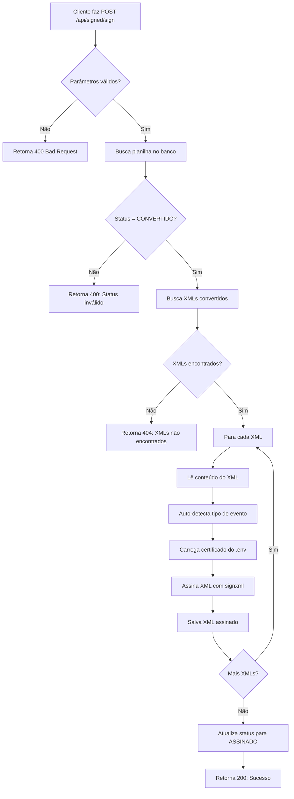

# 📜 Guia de Uso de Certificados Digitais

Este documento explica como configurar e utilizar certificados digitais para assinatura de XMLs na DarfFlow API.

## 📁 Certificados Disponíveis

Na pasta `/certificate` você encontra os seguintes arquivos:

```
certificate/
├── cert_teste_a3.pfx           # Certificado original no formato PKCS#12
├── cert_teste_a3_cert.pem      # Certificado extraído em formato PEM
├── cert_teste_a3_key.pem       # Chave privada em formato PEM
└── certificate_final.pem       # Certificado final combinado (cert + key)
```

### 🔐 Tipos de Certificado

| Arquivo | Formato | Descrição | Uso |
|---------|---------|-----------|-----|
| `cert_teste_a3.pfx` | PKCS#12 | Certificado completo com chave privada protegida por senha | Produção, requer senha |
| `cert_teste_a3_cert.pem` | PEM | Apenas o certificado público | Verificação |
| `cert_teste_a3_key.pem` | PEM | Apenas a chave privada | Testes (não use em produção) |
| `certificate_final.pem` | PEM | Certificado + chave privada combinados | Desenvolvimento/Testes |

## ⚙️ Configuração

### 1. Variáveis de Ambiente

Configure as seguintes variáveis no arquivo `.env`:

```bash
# Caminho do certificado (obrigatório)
CERTIFICATE_PATH=certificate/certificate_final.pem

# Senha do certificado (opcional, apenas para .pfx/.p12)
CERTIFICATE_PASSWORD=

# OU para certificado com senha
CERTIFICATE_PATH=certificate/cert_teste_a3.pfx
CERTIFICATE_PASSWORD=sua_senha_aqui
```

### 2. Formatos Suportados

A API aceita os seguintes formatos de certificado:

- **.pfx / .p12** - PKCS#12 (recomendado para produção)
- **.pem** - PEM (certificado + chave combinados)
- **.crt + .key** - Par de arquivos separados (não implementado ainda)

## 🚀 Como Usar a Rota de Assinatura

### Endpoint

```
POST /api/signed/sign
```

### Autenticação

```
Authorization: Bearer <seu_token_jwt>
```

### Parâmetros (Query String)

| Parâmetro | Tipo | Obrigatório | Descrição |
|-----------|------|-------------|-----------|
| `spreadsheet_id` | UUID | Sim | ID da planilha com XMLs processados |
| `event` | String | Sim | Código do evento (ex: "4020") |
| `certificate_password` | String | Não | Senha do certificado (se usar .pfx/.p12) |

### Exemplos de Requisição

#### 1. Usando certificado PEM (sem senha)

```bash
curl -X POST "http://localhost:5000/api/signed/sign?spreadsheet_id=123e4567-e89b-12d3-a456-426614174000&event=4020" \
  -H "Authorization: Bearer seu_token_jwt"
```

#### 2. Usando certificado PFX (com senha)

```bash
curl -X POST "http://localhost:5000/api/signed/sign?spreadsheet_id=123e4567-e89b-12d3-a456-426614174000&event=4020&certificate_password=minha_senha" \
  -H "Authorization: Bearer seu_token_jwt"
```

#### 3. Usando JavaScript/Fetch

```javascript
const response = await fetch('http://localhost:5000/api/signed/sign?' + new URLSearchParams({
    spreadsheet_id: '123e4567-e89b-12d3-a456-426614174000',
    event: '4020',
    certificate_password: 'minha_senha' // Opcional
}), {
    method: 'POST',
    headers: {
        'Authorization': `Bearer ${token}`
    }
});

const result = await response.json();
console.log(result);
```

#### 4. Usando Python/Requests

```python
import requests

url = "http://localhost:5000/api/signed/sign"
params = {
    "spreadsheet_id": "123e4567-e89b-12d3-a456-426614174000",
    "event": "4020",
    "certificate_password": "minha_senha"  # Opcional
}
headers = {
    "Authorization": f"Bearer {token}"
}

response = requests.post(url, params=params, headers=headers)
print(response.json())
```

### Resposta de Sucesso (200)

```json
{
    "message": "XMLs assinados com sucesso",
    "total_xmls": 150,
    "signed_xmls": 150,
    "xmls_with_error": 0,
    "signed_directory": "/data/signed/COMPANY001/4020/2024",
    "spreadsheet_status": "ASSINADO"
}
```

### Resposta de Erro

```json
{
    "message": "Erro ao assinar XMLs: Invalid certificate format"
}
```

## 🔒 Fluxo de Assinatura



## 🛡️ Segurança

### ⚠️ IMPORTANTE: Proteção da Senha

**NUNCA** armazene senhas de certificados diretamente no código ou em variáveis de ambiente de repositórios públicos!

### Boas Práticas

1. **Desenvolvimento:**
   - Use `certificate_final.pem` (sem senha)
   - Configure `CERTIFICATE_PASSWORD=` (vazio)

2. **Produção:**
   - Use certificado `.pfx` ou `.p12` com senha forte
   - Armazene a senha em secret managers:
     - AWS Secrets Manager
     - Azure Key Vault
     - HashiCorp Vault
     - Kubernetes Secrets

3. **Docker:**
   ```bash
   docker run -e CERTIFICATE_PASSWORD=$(cat /run/secrets/cert_password) ...
   ```

4. **Kubernetes:**
   ```yaml
   env:
     - name: CERTIFICATE_PASSWORD
       valueFrom:
         secretKeyRef:
           name: app-secrets
           key: certificate-password
   ```

## 🔧 Convertendo Certificados

### PFX para PEM (com senha)

```bash
# Extrair certificado
openssl pkcs12 -in cert.pfx -clcerts -nokeys -out cert.pem

# Extrair chave privada
openssl pkcs12 -in cert.pfx -nocerts -nodes -out key.pem

# Combinar em um único arquivo
cat cert.pem key.pem > certificate_final.pem
```

### PEM para PFX (criar arquivo com senha)

```bash
openssl pkcs12 -export -out cert.pfx -inkey key.pem -in cert.pem
```

## 📋 Eventos Suportados

A API suporta assinatura digital para todos os 23 eventos do EFD-Reinf:

| Código | Evento |
|--------|--------|
| 1000 | Informações do Contribuinte |
| 1070 | Tabela de Processos Administrativos/Judiciais |
| 2010 | Retenção Contribuição Previdenciária - Serviços Tomados |
| 2020 | Retenção Contribuição Previdenciária - Serviços Prestados |
| 2030 | Recursos Recebidos por Associação Desportiva |
| 2040 | Recursos Repassados para Associação Desportiva |
| 2050 | Comercialização da Produção por Produtor Rural PJ |
| 2060 | Contribuição Previdenciária sobre a Receita Bruta - CPRB |
| 2098 | Reabertura dos Eventos Periódicos |
| 2099 | Fechamento dos Eventos Periódicos |
| **4020** | Pagamento a Beneficiário Pessoa Jurídica |
| 4040 | Pagamento a Beneficiário Pessoa Física |
| 4080 | Retenção no Recebimento |
| 4099 | Fechamento/Reabertura dos Eventos da Série R-4000 |
| 9000 | Exclusão de Eventos |
| 9001 | Bases e Tributos - Retenções na Fonte |
| 9005 | Bases e Tributos - Retenções na Fonte (Consolidado) |
| 9011 | Bases e Tributos - CPRB |
| 9015 | Bases e Tributos - CPRB (Consolidado) |

## 🐛 Troubleshooting

### Erro: "CERTIFICATE_PATH não configurado"

**Causa:** Variável de ambiente não definida

**Solução:**
```bash
# No .env
CERTIFICATE_PATH=certificate/certificate_final.pem
```

### Erro: "Invalid certificate format"

**Causa:** Certificado corrompido ou formato inválido

**Solução:**
1. Verifique se o arquivo existe
2. Valide o formato:
```bash
openssl x509 -in certificate.pem -text -noout
```

### Erro: "Nenhum XML convertido encontrado"

**Causa:** XMLs não foram processados antes da assinatura

**Solução:**
1. Primeiro processe a planilha: `POST /api/spreadsheets/process`
2. Depois assine os XMLs: `POST /api/signed/sign`

### Erro: "Status da planilha deve ser CONVERTIDO"

**Causa:** Tentando assinar XMLs que ainda não foram convertidos

**Solução:**
Verifique o status da planilha:
```bash
GET /api/spreadsheets/?spreadsheet_id={id}
```

Status deve ser `CONVERTIDO` antes de assinar.

## 📚 Referências

- [EFD-Reinf - Manual de Orientação](http://sped.rfb.gov.br/pagina/show/2587)
- [XML Digital Signature (XMLDSig)](https://www.w3.org/TR/xmldsig-core/)
- [Assinatura Digital ICP-Brasil](https://www.gov.br/iti/pt-br)
- [signxml Documentation](https://signxml.readthedocs.io/)

---

**Última atualização:** 2025-11-23
**Versão da API:** 1.0.0
